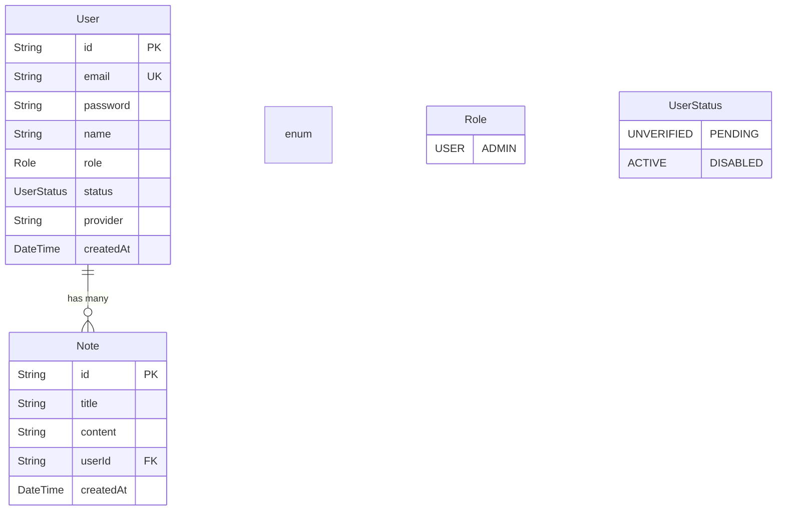

# Database Design

## Schema Overview

We use **PostgreSQL** managed by **Prisma ORM**.

### ER Diagram



## Migration Flow

We use `prisma migrate` to manage schema changes.

1.  **Edit Schema:** Modify `apps/api/prisma/schema.prisma`.
2.  **Generate Migration:**
    ```bash
    pnpm turbo run db:migrate
    # OR directly
    cd apps/api && npx prisma migrate dev --name add_new_field
    ```
3.  **Generate Client:** The client is automatically regenerated after migration, but you can force it:
    ```bash
    pnpm turbo db:generate
    ```

## Indexing Strategy
*   Foreign Keys are automatically indexed by Prisma in many cases, but we explicitly add `@@index([userId])` in the `Note` model to optimize `findAllByUserId` queries, which is a critical path.
