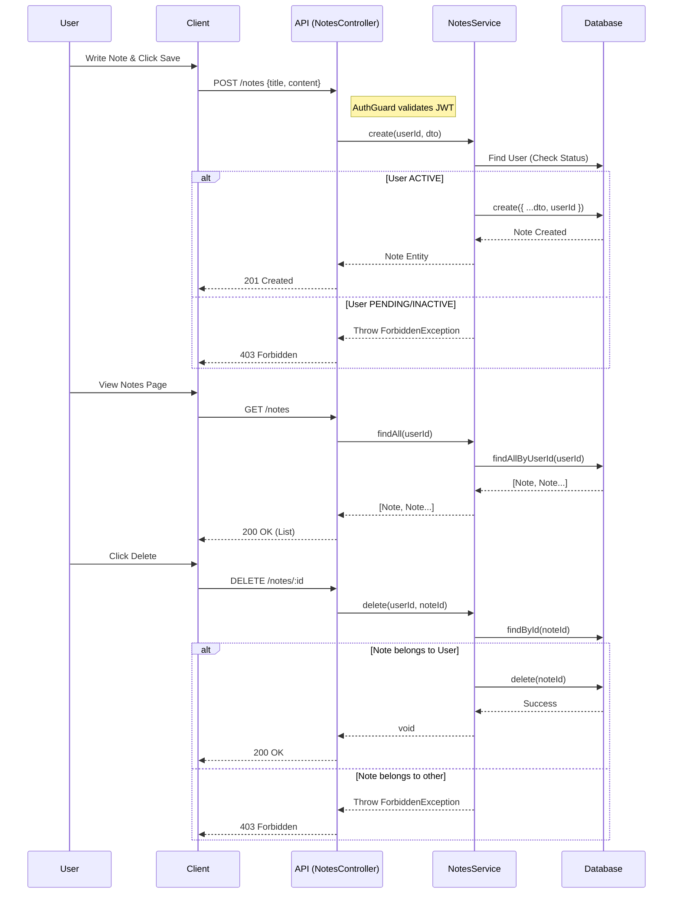

# Personal Notes Feature

**Actors:**
- **User**: An authenticated user with `ACTIVE` status.
- **Client**: The frontend application (React).
- **API**: The NestJS Backend (NotesController).
- **NotesService**: Business logic for notes.
- **Database**: Stores notes (Prisma).

## Use Cases
1.  **Create Note:** User creates a title/content note.
2.  **List Notes:** User sees only their own notes.
3.  **Delete Note:** User deletes one of their notes.

## Sequence Diagram

