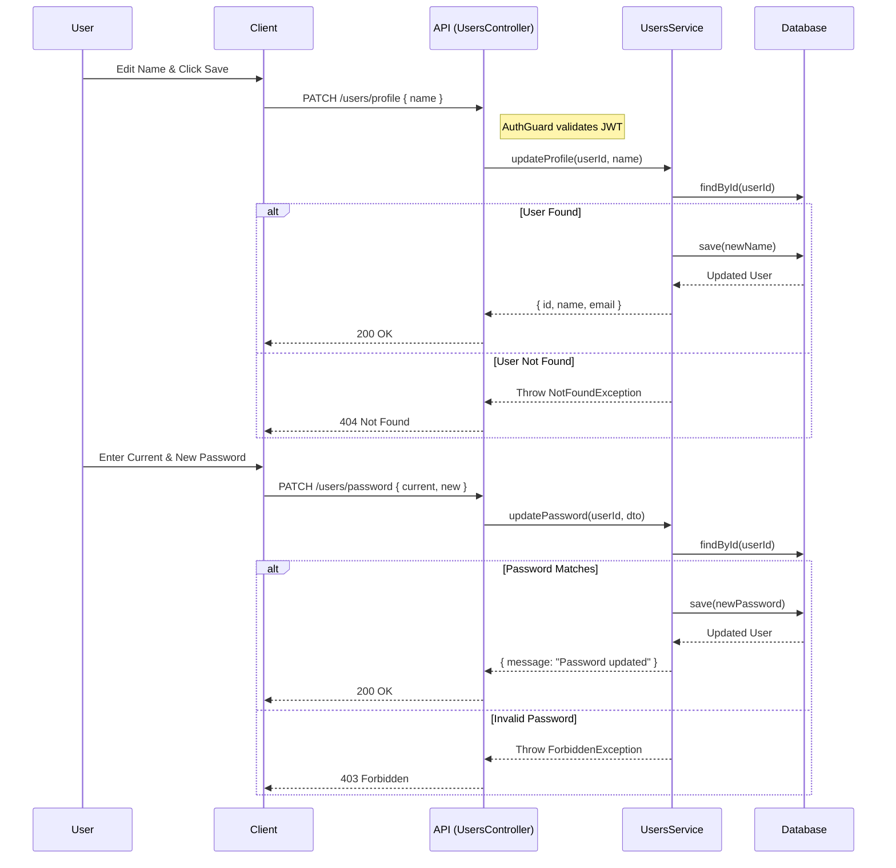

# User Profile Feature

**Actors:**
- **User**: An authenticated user with `ACTIVE` status.
- **Client**: The frontend application (React).
- **API**: The NestJS Backend (UsersController).
- **UsersService**: Business logic for user updates.
- **Database**: Stores user records.

## Use Cases
1.  **Update Profile:** User updates their display name.
2.  **Update Password:** User updates their password (providing current password).

## Sequence Diagram

