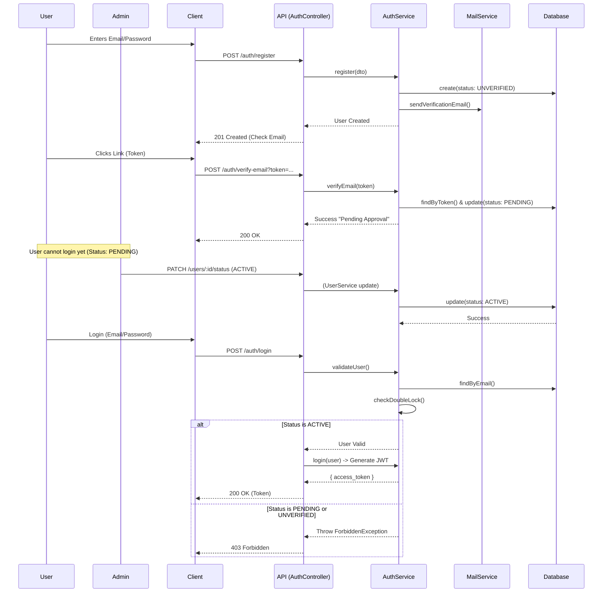

# functional/auth-flow.md

## Double Lock Authentication Flow

**Actors:**
- **User**: The person trying to register and log in.
- **Admin**: The system administrator who approves accounts.
- **Client**: The frontend application (React).
- **API**: The NestJS Backend (AuthController).
- **AuthService**: Handles business logic for authentication.
- **MailService**: Handles sending emails.
- **Database**: Stores user records.

## Use Cases
1.  **Register:** User signs up with email/password. System sends verification email. Status: `UNVERIFIED`.
2.  **Verify Email:** User clicks link. System validates token. Status: `PENDING`.
3.  **Admin Approval:** Admin reviews `PENDING` users and activates them. Status: `ACTIVE`.
4.  **Login:** User logs in. System checks credentials AND `ACTIVE` status.

## Sequence Diagram

