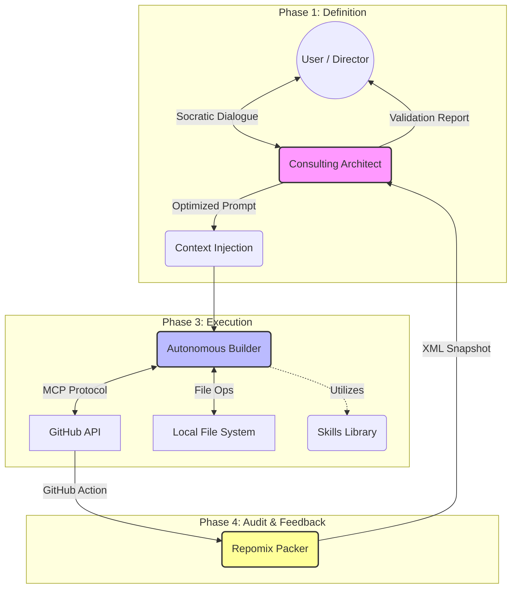
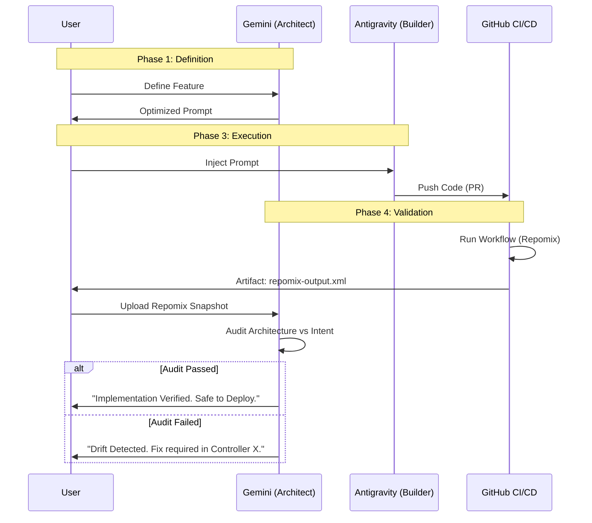

# Assisted Software Engineering: The Antigravity Flow Architecture

The software industry is crossing a critical threshold. Manual, line-by-line coding is giving way to **strategic solution orchestration**. Within our "Golden Boilerplate" ecosystem, we have crystallized this transition by implementing a workflow where Artificial Intelligence is not merely an autocomplete assistant, but a **full-fledged engineering partner**.

This article dissects the internal methodology we use to transform an abstract intent into a production deployment, relying on an architecture of autonomous agents and strict technical governance.

## Core Concepts: Defining the Machinery

To understand our flow, we must first define the technical components that make "Antigravity" possible.

### Architecture Overview: The Closed Loop

We have moved beyond linear development to a **Circular Architecture**. The system not only writes code but reads and validates it.



### 1. What is an AI Agent?

Unlike a standard LLM (Large Language Model) chat interface, an **Agent** is a system capable of reasoning, planning, and **acting** upon the world. It possesses:

* **Context Awareness:** It understands the entire repository structure.
* **Tool Access:** It can read files, execute terminal commands, and interact with APIs.
* **Agency:** It can make decisions based on the output of previous actions.

### 2. What are "Skills"?

Skills are modular capability units installed in `.agent/skills/`. They act as the agent's procedural memory (e.g., `git-github-ops` for branch management).

### 3. Repomix (The Observer)

Repomix is our serialization tool. It packs the entire repository state into a single XML/Text structure. This allows an external AI (Gemini) to "read" the entire project in one context window to perform holistic audits.

---

## The Workflow: A Quadrilogy of Phases

### Phase 1: Socratic & Interactive Definition

The biggest risk in AI-assisted development is ambiguity. Therefore, we institutionalized a **"Validation Loop"**. The result is not code, but an **Optimized Prompt** that acts as a technical contract.

### Phase 2: Context Injection

The human developer transfers the Optimized Prompt into the Antigravity execution environment. Deliberation ends; construction begins.

### Phase 3: The Autonomous Execution Loop

Antigravity does not "spit out" code in a single step. It follows a simulated engineering lifecycle governed by its **Skills**.

### Phase 4: Posterior Validation (The Audit)

This is the distinguishing feature of our architecture. How do we ensure the agent didn't "hallucinate" or introduce subtle architectural drifts?

1. **The Trigger:** When a Pull Request is opened or merged, a GitHub Workflow fires.
2. **The Packing:** The workflow executes `npx repomix`, generating a high-fidelity snapshot of the codebase (`repomix-output.xml`).
3. **The Analysis:** This snapshot is fed back to **Gemini (The Architect)**.
4. **The Verdict:** Gemini compares the *Actual Implementation* (Repomix) against the *Original Intent* (Phase 1). It verifies:
* Did we actually implement the "Double Lock"?
* Are the DTOs strictly typed?
* Did the folder structure follow the "Gentleman Pattern"?




---

## Infrastructure & Deployment

The cycle does not end at the "merge". Our "Golden Boilerplate" supports a sophisticated, automated deployment strategy.

### Hybrid Deployment Strategy

To maximize performance and scalability, we use a decoupled deployment architecture connected by a secure bridge.

```mermaid
graph LR
    Browser(User Browser)
    subgraph "Frontend Layer (Vercel)"
        CDN[Edge Network]
        Static[React App / Next.js]
    end
    subgraph "Backend Layer (Railway)"
        API[NestJS Container]
        DB[(PostgreSQL)]
    end
    
    Browser -->|HTTPS Load| CDN
    CDN --> Static
    Browser -->|HTTPS API Calls (CORS)| API
    API -->|TCP Connection| DB
    
    style CDN fill:#000,stroke:#fff,color:#fff
    style API fill:#fff,stroke:#000

```

* **Frontend (Vercel):** We leverage the global Edge network to serve our static React application (`apps/web`).
* **Backend (Railway/Containers):** The NestJS API is deployed as a persistent Docker container (`apps/api/Dockerfile`).
* **The Bridge:** Both worlds connect securely via strict CORS policies and synchronized environment variables (`VITE_API_URL`).

---

## References & Credits

### Internal Artifacts

* **Skill: GitOps:** `.agent/skills/git-automation/SKILL.md`
* **Skill: Code Review:** `.agent/skills/code-review-policy/SKILL.md`
* **Skill: Documentation:** `.agent/skills/documentation-architect/SKILL.md`
* **Snapshot Tool:** `repomix-output.xml` (Generated via CI)

### External Resources & Inspiration

* **[Gentleman Programming - Clean Architecture Boilerplate](https://www.youtube.com/watch?v=8WlGLOeFMOM):** The conceptual foundation for our "Golden Boilerplate" structure and the "Gentleman Pattern".
* **[El mejor prompt para hacer Code Review en Python](https://j2logo.com/el-mejor-prompt-para-hacer-code-review-en-python/) (J2Logo):** The foundational analysis used to design our `code-review-policy` skill.
* **[Repomix](https://github.com/yamadashy/repomix):** The tool used to serialize our repository for AI analysis.
* **[Keep a Changelog](https://keepachangelog.com/en/1.0.0/):** The standard specification we follow for automated release notes generation.

---

**Conclusion:** By closing the loop with **Repomix Validation**, we move from "Trust" to "Verify". The human developer orchestrates a system where Strategy (Gemini), Execution (Antigravity), and Audit (Repomix) work in harmony to produce industrial-grade software.